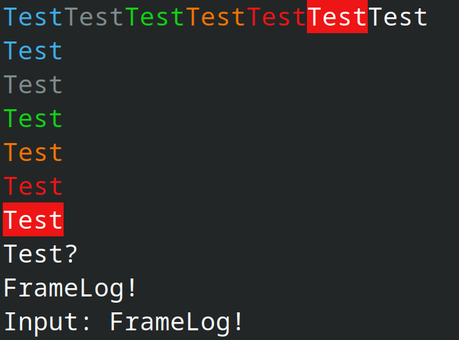

# FrameLog

FrameLog is a lightweight library for outputting logs to the console and file in **C++**.

## Version 1.8.0-release


[]()
[]()

\


## Features 

- **Lightweight** - Only 75.0 KiB when compiled in Release mode
- **Buffered console output** - Efficient string accumulation before flush
- **File logging** - Simple file writer with append/overwrite modes
- **Stream API** - `logger.custom << "Message " << value << "\n";`
- **Color support** - ANSI colors + RGB (24-bit true color)
- **Simple API** - Trace, Print, Info, Warn, Error, Fatal levels
- **Cross-platform** - Linux, Windows, macOS
- **Minimal dependencies** - Only standard C++ library
- **Patterns** - output with the required data 
(for example, time, date, LogLevel)


## Dependencies
- Standard C++ library (`std`)  
- Compatible with **C++17** and later (C++20 recommended)

## Output Example:



## License
FrameLog is distributed under the **MIT License**.  
See [LICENSE](LICENSE) for details.

## Supported Platforms

Any platform with the **standard C++ library**

## Connect to your premake-file
add line:
include "FrameLog/include/FrameLog/premake5.lua"

## Performance & Size

FrameLog is **lightweight**:
Binary Size Comparison:

| Library       | Size (KiB) | vs FrameLog (×) | Language | Notes                          |
| ------------- | ---------- | --------------- | -------- | ------------------------------ |
| FrameLog      | 75.0       | 1.0×            | C++      | Buffered, colors, stream       |
| log.c         | 50.0       | 0.67×           | C        | Minimal                        |
| easylogging++ | 150.0      | 2.0×            | C++      | Header-only                    |
| plog          | 200.0      | 2.67×           | C++      | Header-only                    |
| g3log         | 500.0      | 6.67×           | C++      | Async, crash-safe              |
| NanoLog       | 800.0      | 10.7×           | C++      | Ultra-fast                     |
| quill         | 1229.0     | 16.4×           | C++      | Low-latency                    |
| zlog          | 2048.0     | 27.3×           | C        | Config files                   |
| log4cplus     | 3072.0     | 41.0×           | C++      | Java log4j port                |
| log4cpp       | 4096.0     | 54.6×           | C++      | Apache project                 |
| glog          | 5120.0     | 68.3×           | C++      | Google logging                 |
| spdlog        | 41984.0    | 559.8×          | C++      | Very Fast, fmt-based, patterns |
| Boost.Log     | 61440.0    | 819.2×          | C++      | Full-featured                  |


*Measured FrameLog: Release builds, x64, premake5, gcc15, make*

*Source sizes shown for header-only libraries (marked "src")*


**Why so small?**
- one C++ Template in Logger
- Minimal dependencies (only std)

**Perfect for:**
- Docker containers (minimal images)
- Fast compilation times
- Quick program startup
- for projects where you just need a logger

## Status
**FrameLog** is currently in **Release** stage

## Quick Start
```bash
git clone https://github.com/glpetrikov/FrameLog
cd FrameLog && premake5 gmake2 && cd build && make config=release
cd Release && ./sandbox
```

## Building

> [!WARNING]  
> If there are bugs in FrameLog API calls, they will be displayed in ANY configuration

### Windows

#### premake
``` bash
premake5 vs2022
```
open visual studio(2022)

press f5

### Linux

#### premake
``` bash
./run.sh
```

## Example
### Source files:
[Colors](source/FrameLog/Colors.hpp)\
[Logger.cpp](source/FrameLog/Logger.cpp)\
[Logger.hpp](source/FrameLog/Logger.hpp)

### example code:

1. Include FrameLog in your code and use it:
``` cpp
#include <FrameLog/FrameLog.h>

using namespace FrameLog;

int main() {
    Logger logger("Main");

    logger.custom << "Hello, FrameLog" << FL_VERSION << "-" << FL_STATUS << logger.EndL();
}
```
More examples can be found in the examples folder.
2. build
See the "Building" section above.

## Authors

**Gleb Petrikov**

## Roadmap

### Alpha (Completed)
- Buffered output
- Basic output functions
- Color support
- Basic log levels

### Beta (Completed)
- Additional log levels
- Base Custom format patterns
- Base Output pattern scanner
- File Log
- Minimal Log Level

### Release (Current)(Completed)
- full-fledged Custom format patterns
- full-fledged Output pattern scanner
- Additional buffer capabilities